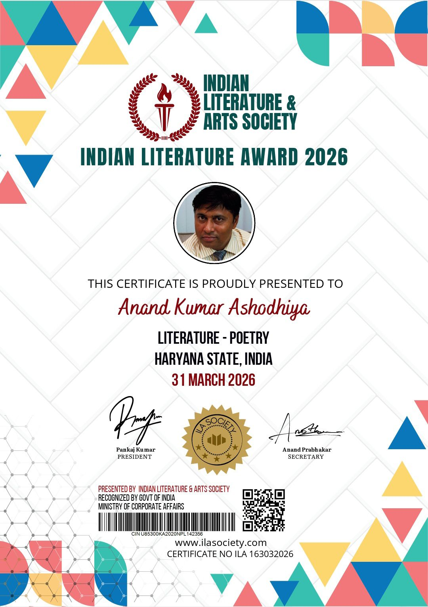
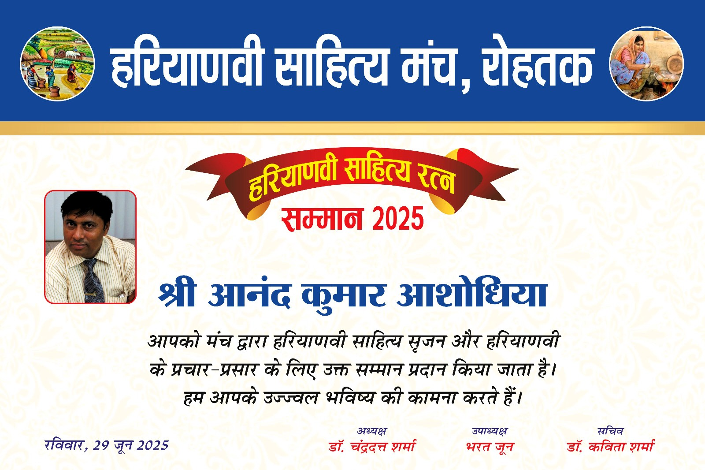

### Quick Links:
[**Home**](index.html) | [**Books & Bibliography**](books.html) | [**Avikavani Publishers**](publishers.html) | [**Gallery & IAF Legacy**](gallery.html) | [**Awards**](awards.html) | [**Contact**](contact.html)

 
  

    <a href="index.html" style="padding: 12px 25px; background-color: #2c3e50; color: white; text-decoration: none; border-radius: 5px; margin-right: 10px; font-weight: bold;">Home</a>
    <a href="books.md" style="padding: 12px 25px; background-color: #2c3e50; color: white; text-decoration: none; border-radius: 5px; font-weight: bold;">Books</a>
  

<h1 style="text-align: center; color: #2c3e50;">Awards & Recognitions</h1>

  

    <h3 style="font-size: 16px; color: #2c3e50; min-height: 40px;">Indian Literature Award 2026</h3>
    
  

  

    <h3 style="font-size: 16px; color: #2c3e50; min-height: 40px;">Haryanvi Sahitya Ratna Samman</h3>
    
  

<h2 style="color: #2c3e50;">Detailed Honors List</h2>

<table style="width:100%; border-collapse: collapse; margin-top: 20px; font-size: 14px; font-family: sans-serif;">
  <tr style="background-color: #2c3e50; color: white; text-align: left;">
    <th style="padding: 12px; border: 1px solid #ddd;">S.No.</th>
    <th style="padding: 12px; border: 1px solid #ddd;">Year/Date</th>
    <th style="padding: 12px; border: 1px solid #ddd;">Award Title</th>
    <th style="padding: 12px; border: 1px solid #ddd;">Conferred By</th>
    <th style="padding: 12px; border: 1px solid #ddd;">Location</th>
  </tr>
  <tr><td style="padding: 10px; border: 1px solid #ddd;">1</td><td style="padding: 10px; border: 1px solid #ddd;">31 Mar 2026</td><td style="padding: 10px; border: 1px solid #ddd;">Indian Literature Award 2026</td><td style="padding: 10px; border: 1px solid #ddd;">ILAS</td><td style="padding: 10px; border: 1px solid #ddd;">Online</td></tr>
  <tr><td style="padding: 10px; border: 1px solid #ddd;">2</td><td style="padding: 10px; border: 1px solid #ddd;">16 Dec 2025</td><td style="padding: 10px; border: 1px solid #ddd;">Pak Sena Atmsamarpan Smriti Samman 2025</td><td style="padding: 10px; border: 1px solid #ddd;">Niswarthi Haryanvi Samooh</td><td style="padding: 10px; border: 1px solid #ddd;">Dhana Jhajjhar</td></tr>
  <tr><td style="padding: 10px; border: 1px solid #ddd;">3</td><td style="padding: 10px; border: 1px solid #ddd;">07 Dec 2025</td><td style="padding: 10px; border: 1px solid #ddd;">Sashastra Sena Jhanda Divas Samman 2025</td><td style="padding: 10px; border: 1px solid #ddd;">Niswarthi Rashtriya Samooh</td><td style="padding: 10px; border: 1px solid #ddd;">Dhana Jhajjhar</td></tr>
  <tr><td style="padding: 10px; border: 1px solid #ddd;">4</td><td style="padding: 10px; border: 1px solid #ddd;">15 Aug 2025</td><td style="padding: 10px; border: 1px solid #ddd;">Swatantrata Divas Smriti Samman 2025</td><td style="padding: 10px; border: 1px solid #ddd;">Niswarthi Desh Bhakti Samooh</td><td style="padding: 10px; border: 1px solid #ddd;">Dhana Jhajjhar</td></tr>
  <tr><td style="padding: 10px; border: 1px solid #ddd;">5</td><td style="padding: 10px; border: 1px solid #ddd;">29 Jun 2025</td><td style="padding: 10px; border: 1px solid #ddd;">Haryanvi Sahitya Ratna Samman</td><td style="padding: 10px; border: 1px solid #ddd;">Haryanvi Sahitya Manch Rohtak</td><td style="padding: 10px; border: 1px solid #ddd;">Rohtak</td></tr>
  <tr><td style="padding: 10px; border: 1px solid #ddd;">6</td><td style="padding: 10px; border: 1px solid #ddd;">2025</td><td style="padding: 10px; border: 1px solid #ddd;">Bharat Ratn Srijak Sammaj 2025</td><td style="padding: 10px; border: 1px solid #ddd;">Niswarthi Haryanvi Samooh</td><td style="padding: 10px; border: 1px solid #ddd;">Dhana Jhajjhar</td></tr>
  <tr><td style="padding: 10px; border: 1px solid #ddd;">7</td><td style="padding: 10px; border: 1px solid #ddd;">2025</td><td style="padding: 10px; border: 1px solid #ddd;">Nau Sena Kavya Srijan Samman 2025</td><td style="padding: 10px; border: 1px solid #ddd;">Niswarthi Desh Bhakti Samooh</td><td style="padding: 10px; border: 1px solid #ddd;">Dhana Jhajjhar</td></tr>
  <tr><td style="padding: 10px; border: 1px solid #ddd;">8</td><td style="padding: 10px; border: 1px solid #ddd;">2025</td><td style="padding: 10px; border: 1px solid #ddd;">Nav Samvatvar Sahitya Samman 2025</td><td style="padding: 10px; border: 1px solid #ddd;">DD Bharti Network</td><td style="padding: 10px; border: 1px solid #ddd;">Jaipur</td></tr>
  <tr><td style="padding: 10px; border: 1px solid #ddd;">9</td><td style="padding: 10px; border: 1px solid #ddd;">2025</td><td style="padding: 10px; border: 1px solid #ddd;">Swarnim Sahitya Shiromani Samman 2025</td><td style="padding: 10px; border: 1px solid #ddd;">Arya Publication</td><td style="padding: 10px; border: 1px solid #ddd;">Lucknow</td></tr>
  <tr><td style="padding: 10px; border: 1px solid #ddd;">10</td><td style="padding: 10px; border: 1px solid #ddd;">2025</td><td style="padding: 10px; border: 1px solid #ddd;">Swaranim Shikshak Gaurav Ratna Award 2025</td><td style="padding: 10px; border: 1px solid #ddd;">Arya Publication</td><td style="padding: 10px; border: 1px solid #ddd;">Lucknow</td></tr>
  <tr><td style="padding: 10px; border: 1px solid #ddd;">11</td><td style="padding: 10px; border: 1px solid #ddd;">2024</td><td style="padding: 10px; border: 1px solid #ddd;">Amar Shaheed Smriti Samman</td><td style="padding: 10px; border: 1px solid #ddd;">Niswarthi Deshbhakti Samooh</td><td style="padding: 10px; border: 1px solid #ddd;">Dhana Jhajjhar</td></tr>
  <tr><td style="padding: 10px; border: 1px solid #ddd;">12</td><td style="padding: 10px; border: 1px solid #ddd;">10 Nov 2024</td><td style="padding: 10px; border: 1px solid #ddd;">Niswarthi Sanjha Sankalan Shilpkar Samman 2024</td><td style="padding: 10px; border: 1px solid #ddd;">Niswarthi Sanjha Sanklan Samooh</td><td style="padding: 10px; border: 1px solid #ddd;">Dhana Jhajjhar</td></tr>
  <tr><td style="padding: 10px; border: 1px solid #ddd;">13</td><td style="padding: 10px; border: 1px solid #ddd;">2024</td><td style="padding: 10px; border: 1px solid #ddd;">Co Author Publication Certificate</td><td style="padding: 10px; border: 1px solid #ddd;">Sjain Publication</td><td style="padding: 10px; border: 1px solid #ddd;">New Delhi</td></tr>
  <tr><td style="padding: 10px; border: 1px solid #ddd;">14</td><td style="padding: 10px; border: 1px solid #ddd;">2024</td><td style="padding: 10px; border: 1px solid #ddd;">Kargil Vijay Shree Samman</td><td style="padding: 10px; border: 1px solid #ddd;">Niswarthi Desh Bhakti Samooh</td><td style="padding: 10px; border: 1px solid #ddd;">Dhana Jhajjhar</td></tr>
  <tr><td style="padding: 10px; border: 1px solid #ddd;">15</td><td style="padding: 10px; border: 1px solid #ddd;">15 Aug 2023</td><td style="padding: 10px; border: 1px solid #ddd;">Kargil Vijay Sena Ki Jay Samman 2023</td><td style="padding: 10px; border: 1px solid #ddd;">Forever Star World Records</td><td style="padding: 10px; border: 1px solid #ddd;">Maharashtra</td></tr>
  <tr><td style="padding: 10px; border: 1px solid #ddd;">16</td><td style="padding: 10px; border: 1px solid #ddd;">06 Aug 2023</td><td style="padding: 10px; border: 1px solid #ddd;">Swatantarta Parva Samman 2023</td><td style="padding: 10px; border: 1px solid #ddd;">Hindi Kavya Sarita Manch</td><td style="padding: 10px; border: 1px solid #ddd;">Bhiwani</td></tr>
  <tr><td style="padding: 10px; border: 1px solid #ddd;">17</td><td style="padding: 10px; border: 1px solid #ddd;">26 Jul 2023</td><td style="padding: 10px; border: 1px solid #ddd;">Kargil Vijay Samman 2023</td><td style="padding: 10px; border: 1px solid #ddd;">Niswarthi Desh Bhakti Samooh</td><td style="padding: 10px; border: 1px solid #ddd;">Dhana Jhajjhar</td></tr>
  <tr><td style="padding: 10px; border: 1px solid #ddd;">18</td><td style="padding: 10px; border: 1px solid #ddd;">04 Jun 2023</td><td style="padding: 10px; border: 1px solid #ddd;">Saraswati Samman 2023</td><td style="padding: 10px; border: 1px solid #ddd;">Hindi Kavya Sarita Manch</td><td style="padding: 10px; border: 1px solid #ddd;">Bhiwani</td></tr>
  <tr><td style="padding: 10px; border: 1px solid #ddd;">19</td><td style="padding: 10px; border: 1px solid #ddd;">16 Dec 2022</td><td style="padding: 10px; border: 1px solid #ddd;">Vijay Divas Smriti Samman 2022</td><td style="padding: 10px; border: 1px solid #ddd;">Niswarthi Desh Bhakti Samooh</td><td style="padding: 10px; border: 1px solid #ddd;">Dhana Jhajjhar</td></tr>
  <tr><td style="padding: 10px; border: 1px solid #ddd;">20</td><td style="padding: 10px; border: 1px solid #ddd;">31 Jul 2022</td><td style="padding: 10px; border: 1px solid #ddd;">Shaheed Udham Singh Smriti Samman 2022</td><td style="padding: 10px; border: 1px solid #ddd;">Niswarthi Rashtriya Samooh</td><td style="padding: 10px; border: 1px solid #ddd;">Dhana Jhajjhar</td></tr>
  <tr><td style="padding: 10px; border: 1px solid #ddd;">21</td><td style="padding: 10px; border: 1px solid #ddd;">26 Jul 2022</td><td style="padding: 10px; border: 1px solid #ddd;">Kargil Gaurav Vijay Samman 2022</td><td style="padding: 10px; border: 1px solid #ddd;">Divyalay Sahityik Parivaar</td><td style="padding: 10px; border: 1px solid #ddd;">Patna</td></tr>
  <tr><td style="padding: 10px; border: 1px solid #ddd;">22</td><td style="padding: 10px; border: 1px solid #ddd;">26 Jun 2022</td><td style="padding: 10px; border: 1px solid #ddd;">Pautr Prasang Kawyanjali Samman 2022</td><td style="padding: 10px; border: 1px solid #ddd;">Niswarthi Samooh</td><td style="padding: 10px; border: 1px solid #ddd;">Dhana Jhajjhar</td></tr>
  <tr><td style="padding: 10px; border: 1px solid #ddd;">23</td><td style="padding: 10px; border: 1px solid #ddd;">22 Jun 2022</td><td style="padding: 10px; border: 1px solid #ddd;">Vatan Premi Kalam Prahari Samman</td><td style="padding: 10px; border: 1px solid #ddd;">Niswarthi Desh Bhakti Samooh</td><td style="padding: 10px; border: 1px solid #ddd;">Dhana Jhajjhar</td></tr>
  <tr><td style="padding: 10px; border: 1px solid #ddd;">24</td><td style="padding: 10px; border: 1px solid #ddd;">Jun 2022</td><td style="padding: 10px; border: 1px solid #ddd;">Ati Sakriya Lekhak Samman 2022</td><td style="padding: 10px; border: 1px solid #ddd;">Niswarthi Sahitya Samooh</td><td style="padding: 10px; border: 1px solid #ddd;">Dhana Jhajjhar</td></tr>
  <tr><td style="padding: 10px; border: 1px solid #ddd;">25</td><td style="padding: 10px; border: 1px solid #ddd;">21 May 2022</td><td style="padding: 10px; border: 1px solid #ddd;">Sadbhaav Smriti Samman 2022</td><td style="padding: 10px; border: 1px solid #ddd;">Niswarthi Desh Bhakti Samooh</td><td style="padding: 10px; border: 1px solid #ddd;">Dhana Jhajjhar</td></tr>
  <tr><td style="padding: 10px; border: 1px solid #ddd;">26</td><td style="padding: 10px; border: 1px solid #ddd;">13 Apr 2022</td><td style="padding: 10px; border: 1px solid #ddd;">Jaliwala Baag Shaheed Smriti Samman 2022</td><td style="padding: 10px; border: 1px solid #ddd;">Niswarthi Desh Bhakti Samooh</td><td style="padding: 10px; border: 1px solid #ddd;">Dhana Jhajjhar</td></tr>
  <tr><td style="padding: 10px; border: 1px solid #ddd;">27</td><td style="padding: 10px; border: 1px solid #ddd;">27 Feb 2022</td><td style="padding: 10px; border: 1px solid #ddd;">Chandrashekhar Azad Smriti Samman 2022</td><td style="padding: 10px; border: 1px solid #ddd;">Niswarthi Deshbhakti Samooh</td><td style="padding: 10px; border: 1px solid #ddd;">Dhana Jhajjhar</td></tr>
  <tr><td style="padding: 10px; border: 1px solid #ddd;">28</td><td style="padding: 10px; border: 1px solid #ddd;">23 Jan 2022</td><td style="padding: 10px; border: 1px solid #ddd;">Azad Hind Sena Smriti Samman 2022</td><td style="padding: 10px; border: 1px solid #ddd;">Niswarthi Deshbhakti Samooh</td><td style="padding: 10px; border: 1px solid #ddd;">Dhana Jhajjhar</td></tr>
  <tr><td style="padding: 10px; border: 1px solid #ddd;">29</td><td style="padding: 10px; border: 1px solid #ddd;">2022</td><td style="padding: 10px; border: 1px solid #ddd;">Kargil Vijay Smriti Samman 2022</td><td style="padding: 10px; border: 1px solid #ddd;">Niswarthi Desh Bhakti Samooh</td><td style="padding: 10px; border: 1px solid #ddd;">Dhana Jhajjhar</td></tr>
  <tr><td style="padding: 10px; border: 1px solid #ddd;">30</td><td style="padding: 10px; border: 1px solid #ddd;">2022</td><td style="padding: 10px; border: 1px solid #ddd;">Floral Tribute to Netaji Subhash Chandra Bose</td><td style="padding: 10px; border: 1px solid #ddd;">Media Coverage</td><td style="padding: 10px; border: 1px solid #ddd;">Sonipat</td></tr>
  <tr><td style="padding: 10px; border: 1px solid #ddd;">31</td><td style="padding: 10px; border: 1px solid #ddd;">09 Sep 2020</td><td style="padding: 10px; border: 1px solid #ddd;">Veterans India President Haryana (Appointed)</td><td style="padding: 10px; border: 1px solid #ddd;">Veterans India New Delhi</td><td style="padding: 10px; border: 1px solid #ddd;">New Delhi</td></tr>
  <tr><td style="padding: 10px; border: 1px solid #ddd;">32</td><td style="padding: 10px; border: 1px solid #ddd;">16 Jul 2020</td><td style="padding: 10px; border: 1px solid #ddd;">Meeting with Haryana Vidhan Sabha Adhyaksh</td><td style="padding: 10px; border: 1px solid #ddd;">Haryana Vidhan Sabha</td><td style="padding: 10px; border: 1px solid #ddd;">Chandigarh</td></tr>
</table>

 

 [**Back to Home**](index.html)
