

<!-- ================= SEO ================= -->
<meta name="description" content="Complete bibliography of Anand Kumar Ashodhiya including ISBN-listed books and peer-reviewed research on Haryanvi Ragni, Pingal Shastra, and Indian folklore.">

<meta name="keywords" content="Anand Kumar Ashodhiya books, Haryanvi Ragni, Pingal Shastra, Hindi literature, Indian folklore, ISBN bibliography">

<meta name="author" content="Anand Kumar Ashodhiya">

<!-- ================= STRUCTURED DATA ================= -->

# 📚 Complete Bibliography

The following table presents the **authoritative list of published books** by Anand Kumar Ashodhiya.  
Click on any title to view detailed information, cover, and availability.

---

<table style="
width:100%;
border-collapse: collapse;
margin-top: 20px;
table-layout: fixed;
font-size: 15px;
">

<colgroup>
<col style="width:42%;">
<col style="width:14%;">
<col style="width:22%;">
<col style="width:22%;">
</colgroup>

<thead>

<tr style="background-color:#f2f2f2;">

<th style="padding:12px;border:1px solid #ddd;">
Title
</th>

<th style="padding:12px;border:1px solid #ddd;text-align:center;">
Language
</th>

<th style="padding:12px;border:1px solid #ddd;text-align:center;">
ISBN
</th>

<th style="padding:12px;border:1px solid #ddd;text-align:center;">
Genre/Form
</th>

</tr>

</thead>

<tbody>

<tr>
<td style="padding:10px;border:1px solid #ddd;">
<a href="books/adhirajan-edition-1.html"><b>Adhirājan (Edition I)</b></a>
</td>
<td style="padding:10px;border:1px solid #ddd;text-align:center;">Haryanvi</td>
<td style="padding:10px;border:1px solid #ddd;text-align:center;white-space:nowrap;font-family:monospace;font-size:13px;">978-81-958735-0-0</td>
<td style="padding:10px;border:1px solid #ddd;text-align:center;">Folk Epic (Ragni)</td>
</tr>

<tr>
<td style="padding:10px;border:1px solid #ddd;">
<a href="books/adhirajan-edition-2.html"><b>Adhirājan (Edition II)</b></a>
</td>
<td style="padding:10px;border:1px solid #ddd;text-align:center;">Haryanvi</td>
<td style="padding:10px;border:1px solid #ddd;text-align:center;white-space:nowrap;font-family:monospace;font-size:13px;">978-93-5469-116-4</td>
<td style="padding:10px;border:1px solid #ddd;text-align:center;">Folk Epic (Ragni)</td>
</tr>

<tr>
<td style="padding:10px;border:1px solid #ddd;">
<a href="books/ath-marjarika-uvaach.html"><b>Ath Marjarika Uvaach</b></a>
</td>
<td style="padding:10px;border:1px solid #ddd;text-align:center;">Hindi</td>
<td style="padding:10px;border:1px solid #ddd;text-align:center;white-space:nowrap;font-family:monospace;font-size:13px;">978-93-5619-397-0</td>
<td style="padding:10px;border:1px solid #ddd;text-align:center;">Historical Epic</td>
</tr>

<tr>
<td style="padding:10px;border:1px solid #ddd;">
<a href="books/saket.html"><b>SĀKET</b></a>
</td>
<td style="padding:10px;border:1px solid #ddd;text-align:center;">English</td>
<td style="padding:10px;border:1px solid #ddd;text-align:center;white-space:nowrap;font-family:monospace;font-size:13px;">978-93-5469-845-3</td>
<td style="padding:10px;border:1px solid #ddd;text-align:center;">Transcreation</td>
</tr>

<tr>
<td style="padding:10px;border:1px solid #ddd;">
<a href="books/antaryatra.html"><b>Antaryātrā</b></a>
</td>
<td style="padding:10px;border:1px solid #ddd;text-align:center;">English</td>
<td style="padding:10px;border:1px solid #ddd;text-align:center;white-space:nowrap;font-family:monospace;font-size:13px;">978-93-5626-749-7</td>
<td style="padding:10px;border:1px solid #ddd;text-align:center;">Poetry</td>
</tr>

<tr>
<td style="padding:10px;border:1px solid #ddd;">
<a href="books/heer-ranjha.html"><b>Heer Ranjha</b></a>
</td>
<td style="padding:10px;border:1px solid #ddd;text-align:center;">Haryanvi</td>
<td style="padding:10px;border:1px solid #ddd;text-align:center;white-space:nowrap;font-family:monospace;font-size:13px;">978-81-989952-9-2</td>
<td style="padding:10px;border:1px solid #ddd;text-align:center;">Ragni & Review</td>
</tr>

<tr>
<td style="padding:10px;border:1px solid #ddd;">
<a href="books/kissa-bhagat-puranmal.html"><b>Kissa Bhagat Puranmal</b></a>
</td>
<td style="padding:10px;border:1px solid #ddd;text-align:center;">Haryanvi</td>
<td style="padding:10px;border:1px solid #ddd;text-align:center;white-space:nowrap;font-family:monospace;font-size:13px;">978-81-989952-8-5</td>
<td style="padding:10px;border:1px solid #ddd;text-align:center;">Ragni & Review</td>
</tr>

<tr>
<td style="padding:10px;border:1px solid #ddd;">
<a href="books/niswarthi-udyoga-parva.html"><b>Niswarthi Udyoga Parva</b></a>
</td>
<td style="padding:10px;border:1px solid #ddd;text-align:center;">English</td>
<td style="padding:10px;border:1px solid #ddd;text-align:center;white-space:nowrap;font-family:monospace;font-size:13px;">978-93-5525-694-2</td>
<td style="padding:10px;border:1px solid #ddd;text-align:center;">Translation</td>
</tr>

<tr>
<td style="padding:10px;border:1px solid #ddd;">
<a href="books/draupadi-ek-lok-chetna.html"><b>Draupadi: Ek Lok Chetna</b></a>
</td>
<td style="padding:10px;border:1px solid #ddd;text-align:center;">Haryanvi</td>
<td style="padding:10px;border:1px solid #ddd;text-align:center;white-space:nowrap;font-family:monospace;font-size:13px;">978-93-344-4058-4</td>
<td style="padding:10px;border:1px solid #ddd;text-align:center;">Ragni & Review</td>
</tr>

<tr>
<td style="padding:10px;border:1px solid #ddd;">
<a href="books/thara-mudda-thari-baat.html"><b>Thara Mudda Thari Baat</b></a>
</td>
<td style="padding:10px;border:1px solid #ddd;text-align:center;">Haryanvi</td>
<td style="padding:10px;border:1px solid #ddd;text-align:center;white-space:nowrap;font-family:monospace;font-size:13px;">978-81-989952-2-3</td>
<td style="padding:10px;border:1px solid #ddd;text-align:center;">Modern Poetry</td>
</tr>

<tr>
<td style="padding:10px;border:1px solid #ddd;">
<a href="books/prem-ke-sau-rang.html"><b>Prem Ke Sau Rang</b></a>
</td>
<td style="padding:10px;border:1px solid #ddd;text-align:center;">Hindi</td>
<td style="padding:10px;border:1px solid #ddd;text-align:center;white-space:nowrap;font-family:monospace;font-size:13px;">978-93-344-5526-7</td>
<td style="padding:10px;border:1px solid #ddd;text-align:center;">Short Poetry</td>
</tr>

<tr>
<td style="padding:10px;border:1px solid #ddd;">
<a href="books/avikavani-ragni-sangrah.html"><b>Avikavani Ragni Sangrah</b></a>
</td>
<td style="padding:10px;border:1px solid #ddd;text-align:center;">Haryanvi</td>
<td style="padding:10px;border:1px solid #ddd;text-align:center;white-space:nowrap;font-family:monospace;font-size:13px;">978-93-344-2403-4</td>
<td style="padding:10px;border:1px solid #ddd;text-align:center;">Folk Collection</td>
</tr>

<tr>
<td style="padding:10px;border:1px solid #ddd;">
<a href="books/kahaan-kahaan-paiband-lagau.html"><b>Kahaan Kahaan Paiband Lagau</b></a>
</td>
<td style="padding:10px;border:1px solid #ddd;text-align:center;">English</td>
<td style="padding:10px;border:1px solid #ddd;text-align:center;white-space:nowrap;font-family:monospace;font-size:13px;">978-93-5592-178-9</td>
<td style="padding:10px;border:1px solid #ddd;text-align:center;">Translation</td>
</tr>

<tr>
<td style="padding:10px;border:1px solid #ddd;">
<a href="books/sain-samaj-ka-itihas.html"><b>Sain Samaj Ka Itihas</b></a>
</td>
<td style="padding:10px;border:1px solid #ddd;text-align:center;">Hindi</td>
<td style="padding:10px;border:1px solid #ddd;text-align:center;white-space:nowrap;font-family:monospace;font-size:13px;">978-93-5655-031-5</td>
<td style="padding:10px;border:1px solid #ddd;text-align:center;">History</td>
</tr>

<tr>
<td style="padding:10px;border:1px solid #ddd;">
<a href="books/haryanvi-boli-se-bhasha.html"><b>Haryanvi: Boli Se Bhasha Tak Ka Bhashai Samarthya</b></a>
</td>
<td style="padding:10px;border:1px solid #ddd;text-align:center;">Hindi</td>
<td style="padding:10px;border:1px solid #ddd;text-align:center;white-space:nowrap;font-family:monospace;font-size:13px;">978-93-5912-062-1</td>
<td style="padding:10px;border:1px solid #ddd;text-align:center;">Linguistic Study</td>
</tr>

</tbody>
</table>

---

<a href="/anand-kumar-ashodhiya/books-library.html">
📚 View Visual Books Library →
</a>

## 🔬 Research Publications

For peer-reviewed research and analytical studies:

👉 <a href="articles/index.html">View Research Publications</a>

---

<!-- ================= RESEARCH WIKI SECTION ================= -->

<h3 style="margin-top:0;color:#0056b3;">
📖 Technical Research Documentation
</h3>

For detailed prosodic methodologies and extended bibliographic records, please visit the official project Wiki:

<ul style="line-height:1.8;">

<li>
<a href="https://github.com/anandkumarashodhiya/anand-kumar-ashodhiya/wiki" target="_blank">
<b>Research Wiki Home</b>
</a>
– Mission and project overview.
</li>

<li>
<a href="https://github.com/anandkumarashodhiya/anand-kumar-ashodhiya/wiki/Pingala-Shastra-Methodology-in-Haryanvi-Ragni" target="_blank">
<b>Pingala Shastra Methodology</b>
</a>
– Technical framework for Haryanvi Ragni analysis.
</li>

<li>
<a href="https://github.com/anandkumarashodhiya/anand-kumar-ashodhiya/wiki/Bibliography%E2%80%90and%E2%80%90Research" target="_blank">
<b>Bibliography & Research Index</b>
</a>
– Complete list of ISBN books and DOI-indexed papers.
</li>

<li>
<a href="https://github.com/anandkumarashodhiya/anand-kumar-ashodhiya/wiki/Glossary%E2%80%90of%E2%80%90Haryanvi%E2%80%90Prosodic%E2%80%90Terms" target="_blank">
<b>Glossary of Haryanvi Prosodic Terms</b>
</a>
– Glossary of Haryanvi Prosodic Terms (Pingal Shastra).
</li>

</ul>



### **Availability**
Most titles are available via **Avikavani Publishers** and can be found on **Google Play Books**, **Amazon**, and the **WorldCat Global Library Registry**.

  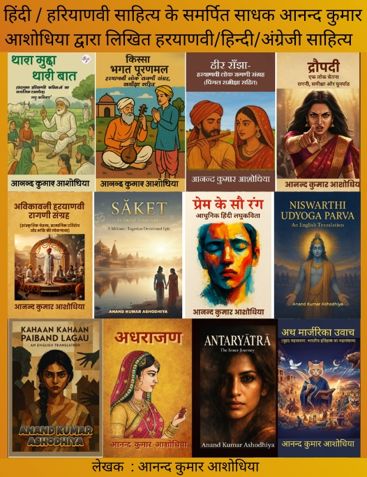

### Featured English Works
1. **SĀKET — An English Trans-creation** (2025)
   * ISBN: 978-93-5469-845-3 | Publisher: Avikavani Publishers
   
   * **ISBN Proof:** 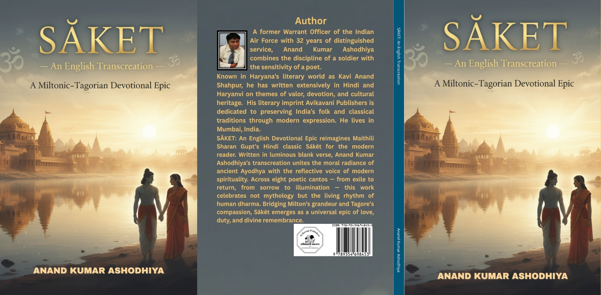 
   * [Buy on Pothi](https://store.pothi.com/book/anand-kumar-ashodhiya-s%C4%81ket-english-transcreation/) | [Buy on Amazon](https://www.amazon.co.uk/dp/935469845X)

2. **Kahaan Kahaan Paiband Lagau — An English Translation** (2025)
   * ISBN: 9789355921789 | Publisher: Avikavani Publishers
   * **ISBN Proof:** 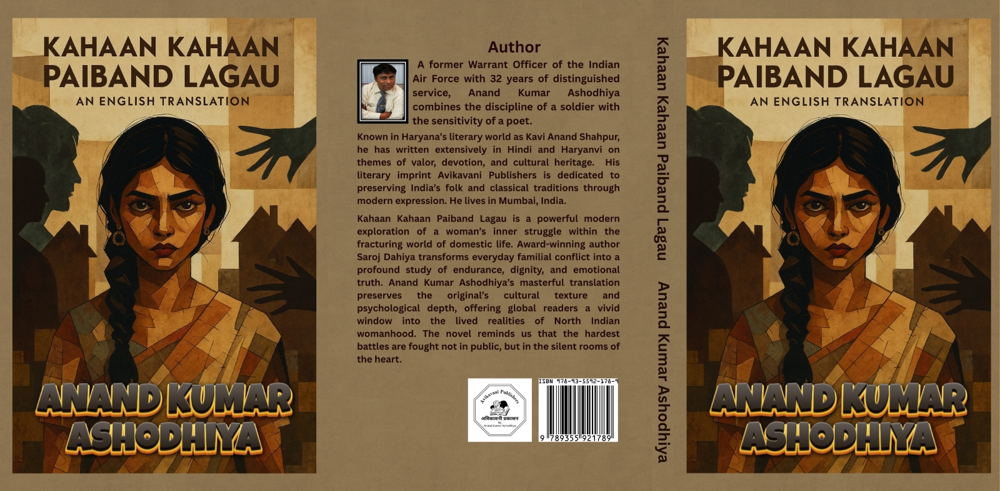  
   * [Buy on Pothi](https://store.pothi.com/book/anand-kumar-ashodhiya-kahaan-kahaan-paiband-lagau-%E2%80%94-english-translation/) | [Buy on Amazon](https://www.amazon.com/dp/9355921780)

3. **NISWARTHI UDYOGA PARVA — An English Translation** (2025)
   * ISBN: 9789355256942 | Publisher: Avikavani Publishers
   * **ISBN Proof:**   
   * [Buy on Pothi](https://store.pothi.com/book/anand-kumar-ashodhiya-niswarthi-udyoga-parva-english-translation/) | [Buy on Amazon](https://www.amazon.com/dp/9355256949)

4. **Antaryātrā — The Inner Journey** (2026)
   * ISBN: 978-93-5626-749-7 | Publisher: Avikavani Publishers
   
   * **ISBN Proof:** 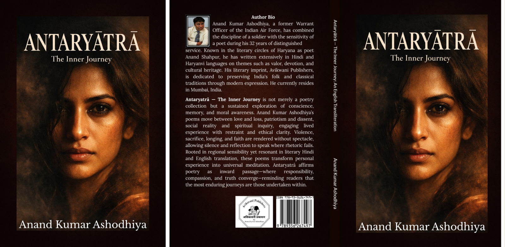  
   * [Buy on Pothi](https://store.pothi.com/book/anand-kumar-ashodhiya-antary%C4%81tr%C4%81-%E2%80%94-inner-journey-english-transliteration/) | [Buy on Amazon](https://www.amazon.com/dp/9356267499)

### Hindi & Haryanvi Literary Works
5. **अधराजण (Revised Edition)**
   * ISBN: 978-93-5469-116-4 | Publisher: Avikavani Publishers
   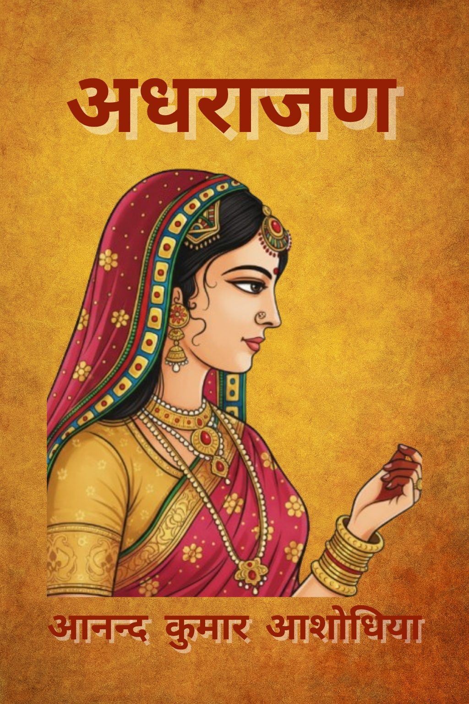
   * **ISBN Proof:** 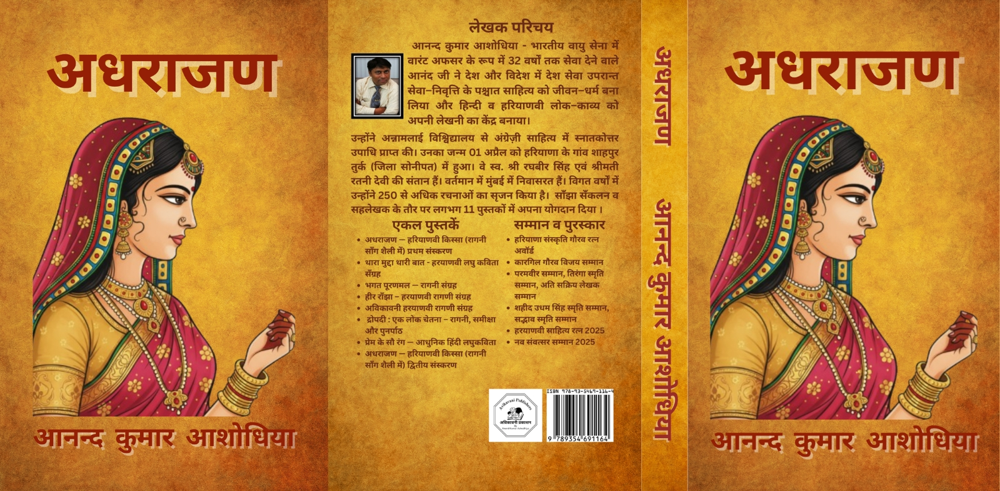  
   * [Buy on Amazon](https://www.amazon.com/dp/B0G2MHLJVW) | [Buy on Pothi](https://store.pothi.com/book/anand-kumar-ashodhiya-%E0%A4%85%E0%A4%A7%E0%A4%B0%E0%A4%BE%E0%A4%9C%E0%A4%A3/)

6. **द्रौपदी : एक लोक चेतना - रागनी, समीक्षा और पुनर्पाठ**
   * ISBN: 978-93-344-4058-4 | Publisher: Avikavani Publishers
     * **ISBN Proof:** 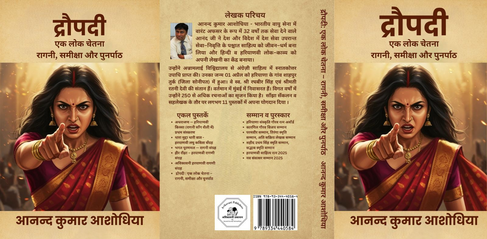  
   * [Buy on Amazon](https://www.amazon.in/dp/B0FY66DNW8) | [Buy on Pothi](https://store.pothi.com/book/%E0%A4%86%E0%A4%A8%E0%A4%A8%E0%A5%8D%E0%A4%A6-%E0%A4%95%E0%A5%81%E0%A4%AE%E0%A4%BE%E0%A4%B0-%E0%A4%86%E0%A4%B6%E0%A5%8B%E0%A4%A7%E0%A4%BF%E0%A4%AF%E0%A4%BE-%E0%A4%D0%B0%E0%A5%8C%E0%A4%AA%E0%A4%A6%E0%A5%80-%E0%A4%8F%E0%A4%95-%E0%A4%B2%E0%A5%8B%E0%A4%95-%E0%A4%9A%E0%A5%87%E0%A4%A4%E0%A4%A8%E0%A4%BE-%E0%A4%B0%E0%A4%BE%E0%A4%97%E0%A4%A8%E0%A5%80-%E0%A4%B8%E0%A4%AE%E0%A5%80%E0%A4%95%E0%A5%8D%E0%A4%B7%E0%A4%BE-%E0%A4%94%E0%A4%B0-%E0%A4%AA%E0%A5%81%E0%A4%A8%E0%A4%B0%E0%A5%8D%E0%A4%AA%E0%A4%BE%E0%A4%A0/)

7. **अविकावनी हरयाणवी रागणी संग्रह**
   * ISBN: 9789334424034 | Publisher: Avikavani Publishers
   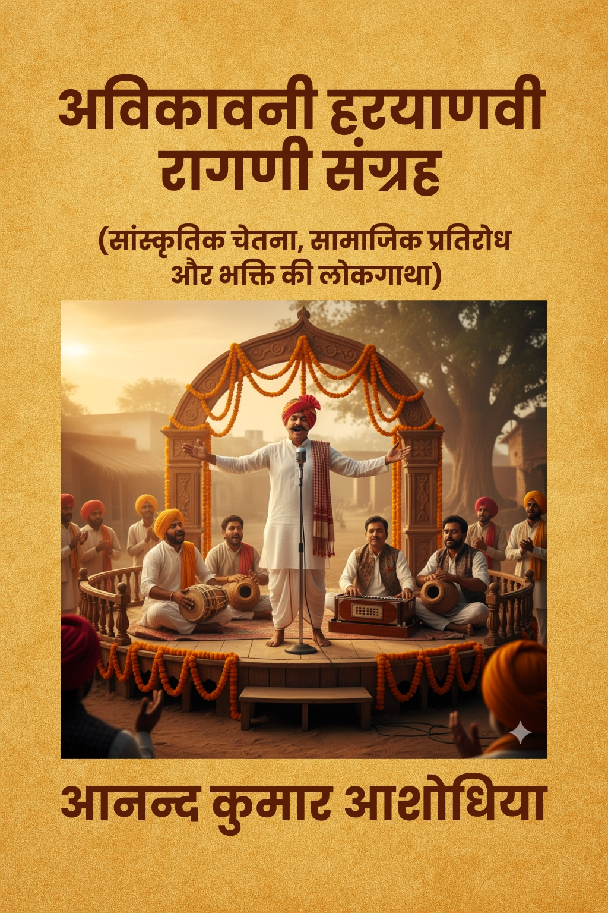
   * **ISBN Proof:** 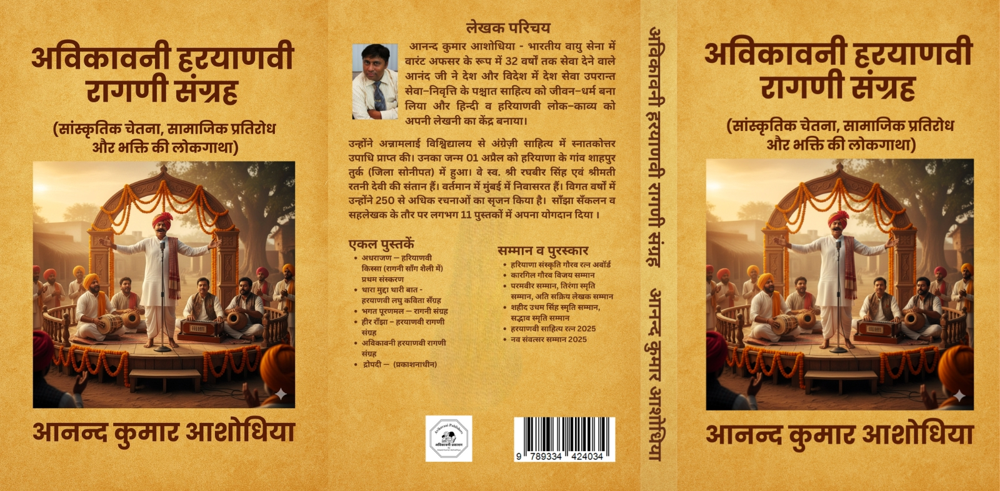 
   * [Buy on Amazon](https://www.amazon.in/dp/B0FSS9J53B) | [Buy on Pothi](https://store.pothi.com/book/%E0%A4%86%E0%A4%A8%E0%A4%A8%E0%A5%8D%E0%A4%A6-%E0%A4%95%E0%A5%81%E0%A4%AE%E0%A4%BE%E0%A4%B0-%E0%A4%86%E0%A4%B6%E0%A5%8B%E0%A4%A7%E0%A4%BF%E0%A4%AF%E0%A4%BE-%E0%A4%85%E0%A4%B5%E0%A4%BF%E0%A4%95%E0%A4%BE%E0%A4%B5%E0%A4%A8%E0%A5%80-%E0%A4%B9%E0%A4%B0%E0%A4%AF%E0%A4%BE%E0%A4%A3%E0%A4%B5%E0%A5%80-%E0%A4%B0%E0%A4%BE%E0%A4%97%E0%A4%A3%E0%A5%80-%E0%A4%B8%E0%A4%82%E0%A4%97%E0%A5%8D%E0%A4%B0%E0%A4%B9/)

8. **प्रेम के सौ रंग — आधुनिक हिंदी लघुकविता**
   * ISBN: 9789334455267 | Publisher: Avikavani Publishers
   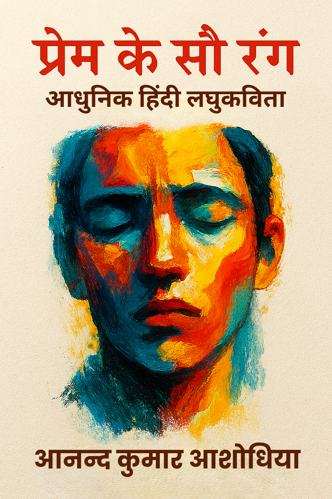
   * **ISBN Proof:** 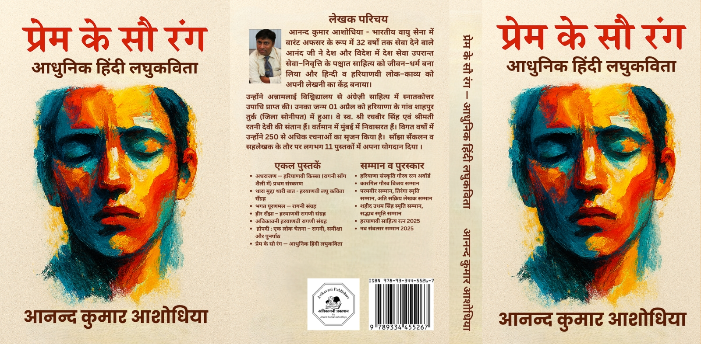 
   * [Buy on Amazon](https://www.amazon.in/dp/B0FSS9J53B) | [Buy on Pothi](https://store.pothi.com/book/%E0%A4%86%E0%A4%A8%E0%A4%A8%E0%A5%8D%E0%A4%A6-%E0%A4%95%E0%A5%81%E0%A4%AE%E0%A4%BE%E0%A4%B0-%E0%A4%86%E0%A4%B6%E0%A5%8B%E0%A4%A7%E0%A4%BF%E0%A4%AF%E0%A4%BE-%E0%A4%AA%E0%A5%8D%E0%A4%B0%E0%A5%87%E0%A4%AE-%E0%A4%95%E0%A5%87-%E0%A4%B8%E0%A5%8C-%E0%A4%B0%E0%A4%82%E0%A4%97-%E2%80%94-%E0%A4%86%E0%A4%A7%E0%A5%81%E0%A4%A8%E0%A4%BF%E0%A4%95-%E0%A4%B9%E0%A4%BF%E0%A4%82%E0%A4%A6%E0%A5%80-%E0%A4%B2%E0%A4%98%E0%A5%81%E0%A4%95%E0%A4%B5%E0%A4%BF%E0%A4%A4%E0%A4%BE/)

9. **हीर राँझा — हरयाणवी लोक रागणी संग्रह**
   * ISBN: 9788198995292 | Publisher: SJain Publication
     * **ISBN Proof:** 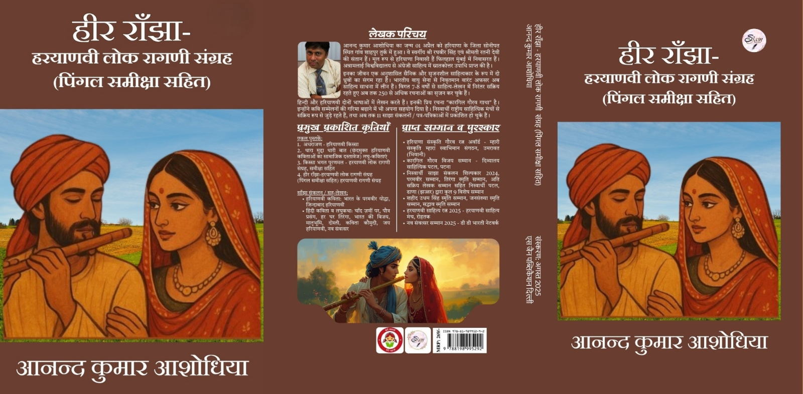 
   * [Buy on Google](https://play.google.com/store/books/details?id=aaqEEQAAQBAJ) | [Buy on Pothi](https://store.pothi.com/book/%E0%A4%86%E0%A4%A8%E0%A4%A8%E0%A5%8D%E0%A4%A6-%E0%A4%95%E0%A5%81%E0%A4%AE%E0%A4%BE%E0%A4%B0-%E0%A4%86%E0%A4%B6%E0%A5%8B%E0%A4%A7%E0%A4%BF%E0%A4%AF%E0%A4%BE-%E0%A4%B9%E0%A5%80%E0%A4%B0-%E0%A4%B0%E0%A4%BE%E0%A4%81%E0%A4%9D%E0%A4%BE-%E0%A4%B9%E0%A4%B0%E0%A4%AF%E0%A4%BE%E0%A4%A3%E0%A4%B5%E0%A5%80-%E0%A4%B2%E0%A5%8B%E0%A4%95-%E0%A4%B0%E0%A4%BE%E0%A4%97%E0%A4%A3%E0%A5%80-%E0%A4%B8%E0%A4%82%E0%A4%97%E0%A5%8D%E0%A4%B0%E0%A4%B9-%E0%A4%AA%E0%A4%BF%E0%A4%82%E0%A4%97%E0%A4%B2-%E0%A4%B8%E0%A4%AE%E0%A5%80%E0%A4%95%E0%A5%8D%E0%A4%B7%E0%A4%BE-%E0%A4%B8%E0%A4%B9%E0%A4%BF%E0%A4%A4/)

10. **किस्सा भगत पूरणमल — हरयाणवी लोक रागणी संग्रह**
   * ISBN: 9788198995285 | Publisher: SJain Publication
     * **ISBN Proof:** 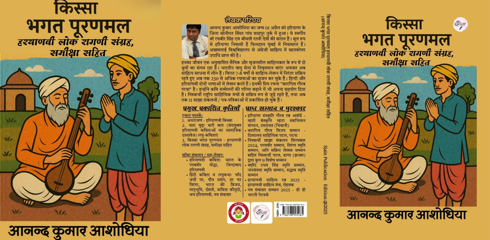 
   * [Buy on Google](https://play.google.com/store/books/details?id=8F9-EQAAQBAJ) | [Buy on Amazon](https://www.amazon.in/dp/B0DSS72NGX)

11. **अथ मार्जरिका उवाच**
   * ISBN: 9789356193970 | Publisher: Avikavani Publishers
   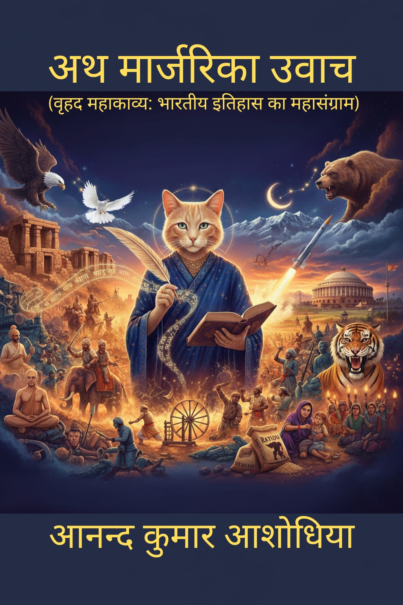
   * **ISBN Proof:** 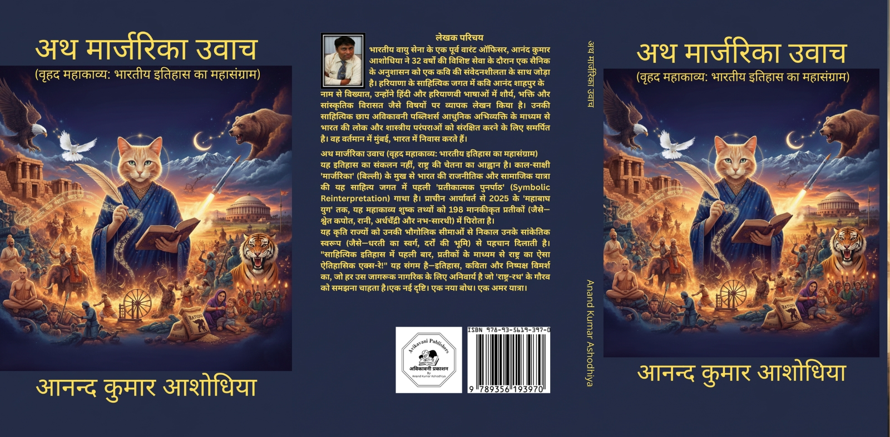 
   * [Buy on Google](https://www.google.co.in/books/edition/_/VbOiEQAAQBAJ) | [Buy on Pothi](https://store.pothi.com/book/anand-kumar-ashodhiya-%E0%A4%85%E0%A4%A5-%E0%A4%AE%E0%A4%BE%E0%A4%B0%E0%A5%8D%E0%A4%9C%E0%A4%B0%E0%A4%BF%E0%A4%95%E0%A4%BE-%E0%A4%89%E0%A4%B5%E0%A4%BE%E0%A4%9A/)

12. **थारा मुद्दा थारी बात — आधुनिक हरियाणवी कविताएँ**
   * ISBN: 9788198995223 | Publisher: Sjain Publication
      * **ISBN Proof:** 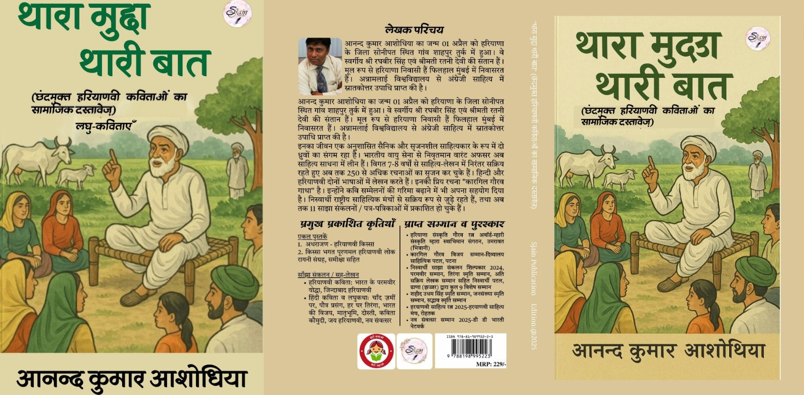 
   * [Buy on Pothi](https://store.pothi.com/book/%E0%A4%86%E0%A4%A8%E0%A4%A8%E0%A5%8D%E0%A4%A6-%E0%A4%95%E0%A5%81%E0%A4%AE%E0%A4%BE%E0%A4%B0-%E0%A4%86%E0%A4%B6%E0%A5%8B%E0%A4%A7%E0%A4%BF%E0%A4%AF%E0%A4%BE-%E2%80%9C%E0%A4%A5%E0%A4%BE%E0%A4%B0%E0%A4%BE-%E0%A4%AE%E0%A5%81%E0%A4%A6%E0%A5%8D%E0%A4%A6%E0%A4%BE-%E0%A4%A5%E0%A4%BE%E0%A4%B0%E0%A5%80-%E0%A4%AC%E0%A4%BE%E0%A4%A4%E2%80%9D-%E0%A4%9B%E0%A4%82%E0%A4%A6%E0%A4%AE%E0%A5%81%E0%A4%95%E0%A5%8D%E0%A4%A4-%E0%A4%B9%E0%A4%B0%E0%A4%BF%E0%A4%AF%E0%A4%BE%E0%A4%A3%E0%A4%B5%E0%A5%80-%E0%A4%95%E0%A4%B5%E0%A4%BF%E0%A4%A4%E0%A4%BE%E0%A4%93%E0%A4%82-%E0%A4%95%E0%A4%BE-%E0%A4%B8%E0%A4%BE%E0%A4%AE%E0%A4%BE%E0%A4%9C%E0%A4%BF%E0%A4%95-%E0%A4%A6%E0%A4%B8%E0%A5%8D%E0%A4%A4%E0%A4%BE%E0%A4%B5%E0%A5%87%E0%A5%9B/)

### Historical & Social Works
13. **सैन समाज का गौरवशाली इतिहास** (2026)
   * ISBN: 9789356550315 | Publisher: Avikavani Publishers 
   
   * **ISBN Proof:** 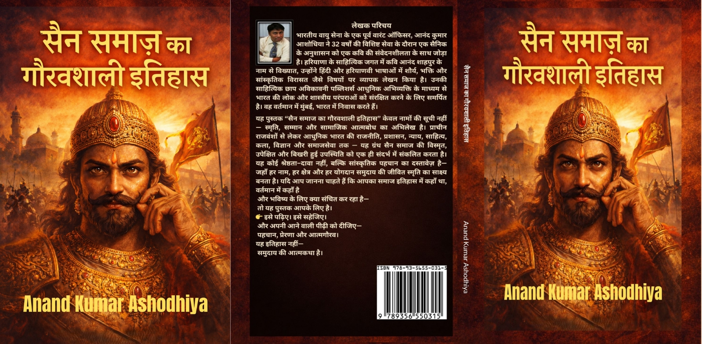 
   * [Buy on Amazon](https://www.amazon.in/dp/B0GGZ63W3Z) | [Buy on Pothi](https://store.pothi.com/book/anand-kumar-ashodhiya-%E0%A4%85%E0%A4%A5-%E0%A4%AE%E0%A4%BE%E0%A4%B0%E0%A5%8D%E0%A4%9C%E0%A4%B0%E0%A4%BF%E0%A4%95%E0%A4%BE-%E0%A4%89%E0%A4%B5%E0%A4%BE%E0%A4%9A/)

### A Study of Linguistic Capacity & Socio Linguistic Works
14. **हरयाणवी: बोली से भाषा तक का भाषाई सामर्थ्य** (2026)
   * ISBN: 9789359120621 | Publisher: Self Published by Anand Kumar Ashodhiya 
   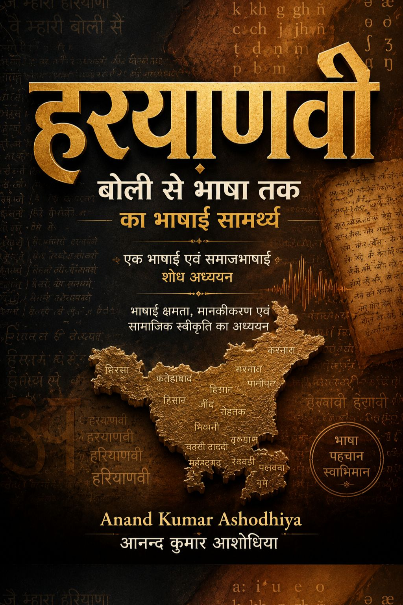
   * **ISBN Proof:** 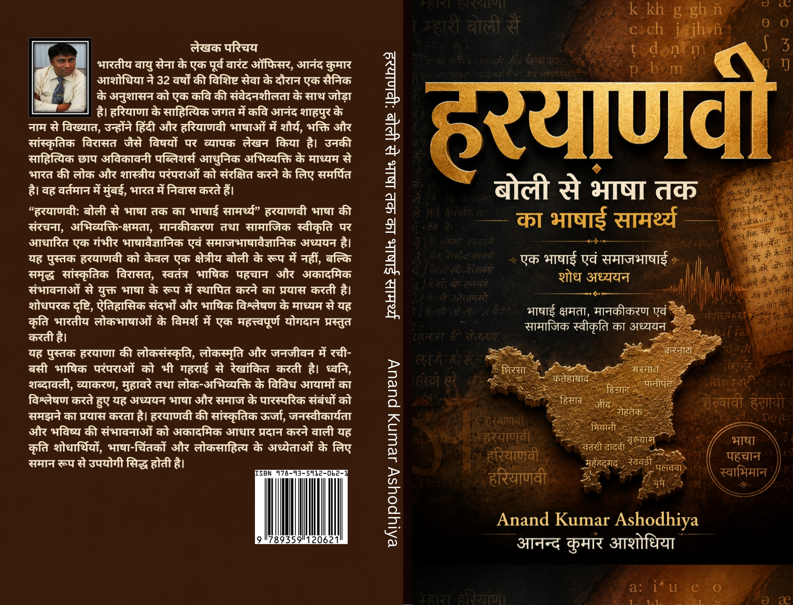 
   * [Buy on Google](https://play.google.com/store/books/details?id=13DaEQAAQBAJ) | [Buy on Pothi](https://store.pothi.com/book/anand-kumar-ashodhiya-%E0%A4%B9%E0%A4%B0%E0%A4%AF%E0%A4%BE%E0%A4%A3%E0%A4%B5%E0%A5%80-%E0%A4%AC%E0%A5%8B%E0%A4%B2%E0%A5%80-%E0%A4%B8%E0%A5%87-%E0%A4%AD%E0%A4%BE%E0%A4%B7%E0%A4%BE-%E0%A4%A4%E0%A4%95-%E0%A4%95%E0%A4%BE-%E0%A4%AD%E0%A4%BE%E0%A4%B7%E0%A4%BE%E0%A4%88-%E0%A4%B8%E0%A4%BE%E0%A4%AE%E0%A4%B0%E0%A5%8D%E0%A4%A5%E0%A5%8D%E0%A4%AF/)

[**Back to Home**](index.html)


