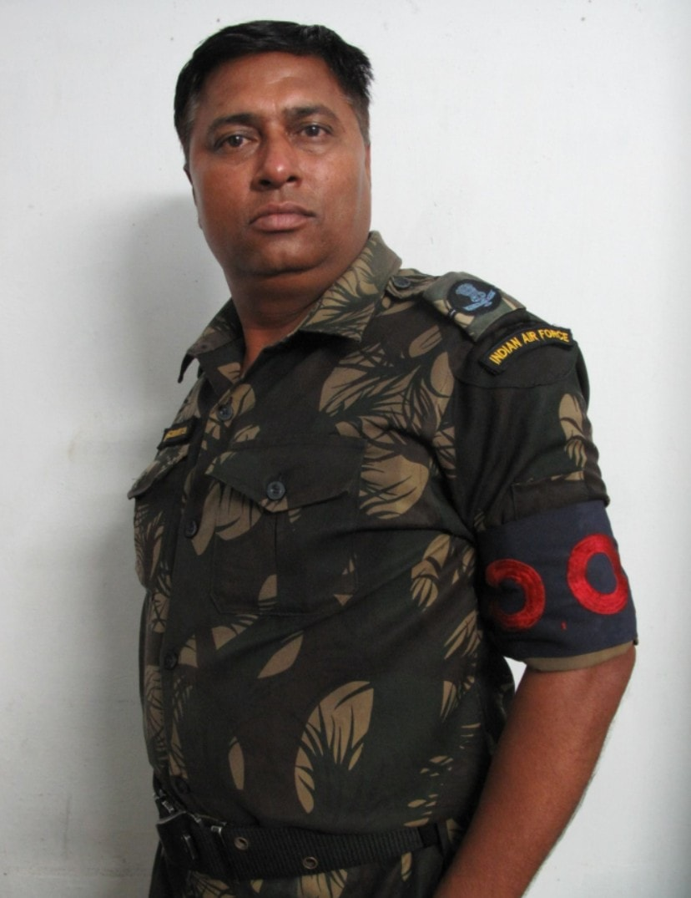
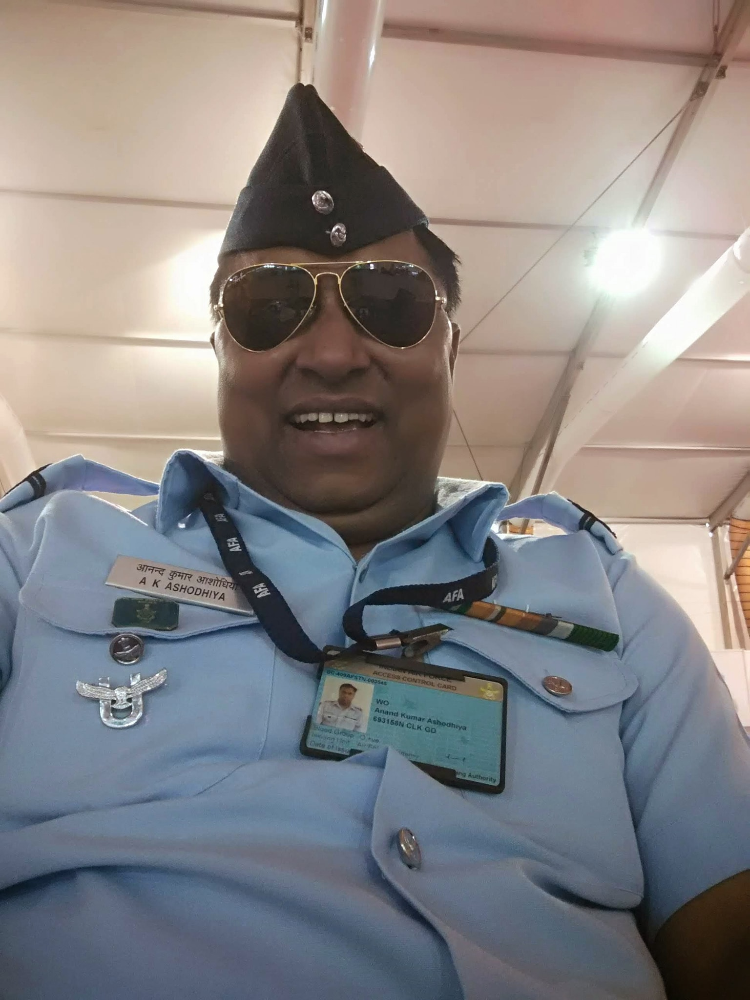
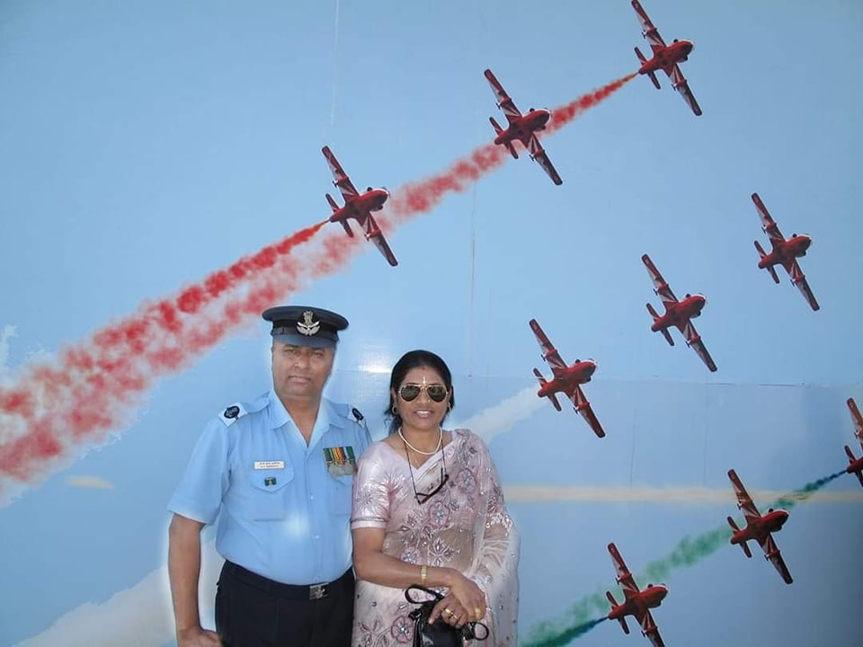
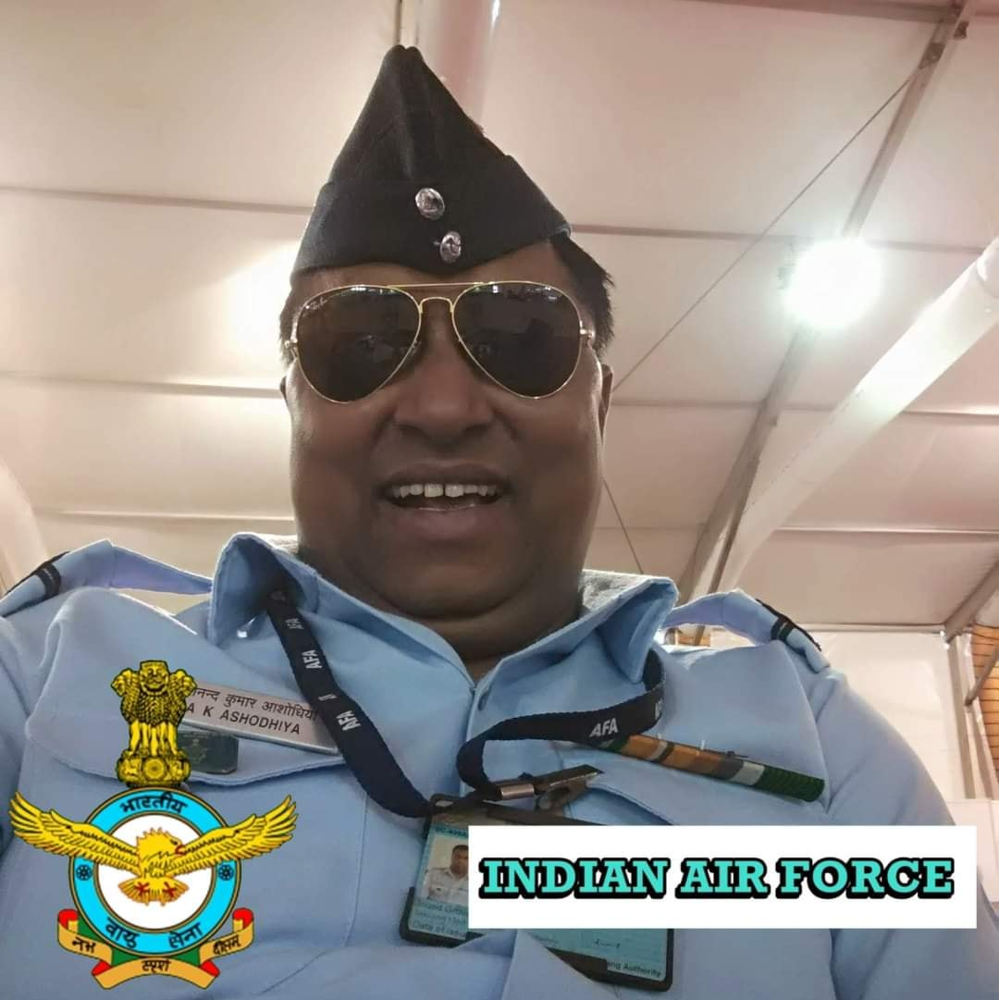
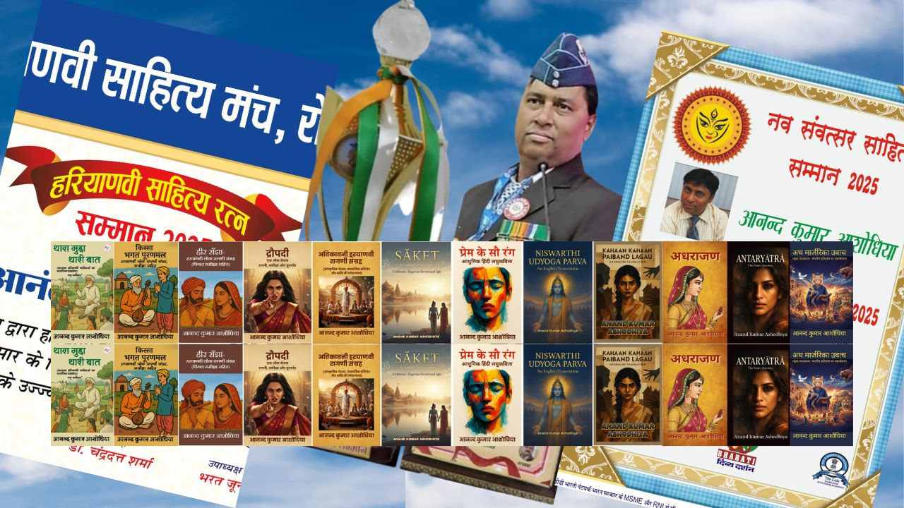
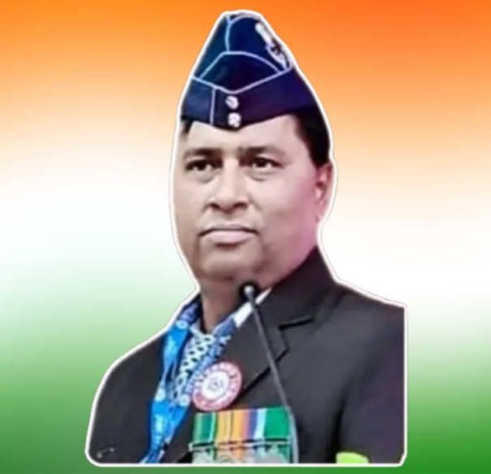

### Quick Links:
[**Home**](index.html) | [**Books & Bibliography**](books.html) | [**Avikavani Publishers**](publishers.html) | [**Gallery & IAF Legacy**](gallery.html) | [**Awards**](awards.html) | [**Contact**](contact.html)

<h1 style="text-align: center; color: #2c3e50;">🇮🇳 Indian Air Force (IAF) Legacy</h1>

Honoring 32 years of dedicated service to the Nation.

  

    
    
Field Service Attire

  

  

    
    
IAF Service Uniform

  

  

    
    
Official Portrait

  

  

    
    
32 Years of Service

  

  
<strong>Warrant Officer Anand Kumar Ashodhiya</strong> dedicated 32 distinguished years to the Indian Air Force. His journey from the village of Shahpur Turk in Sonipat to serving the nation remains a cornerstone of his discipline and literary inspiration.

  

## 🏆 Honours & Recognitions
Recent accolades and literary sammans received for contributions to Indian literature.

| Haryanvi Sahitya Ratna | Nav Samvatsar Samman |
| :---: | :---: |
|  |  |

---

## 🇮🇳 Patriotic Spirit

[**Back to Home**](index.html)
