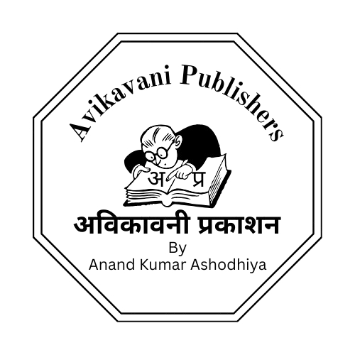

# Avikavani Publishers

### Our Identity

Avikavani Publishers is a dedicated self-publishing imprint established by **Anand Kumar Ashodhiya**.

---
Use code with caution.

Important Deployment Step:
Commit these three files.
Visit Google Search Console.
Use the URL Inspection Tool for gallery.html.
Click "Test Live URL" to make sure Google can see the images.
Click "Request Indexing".
Pro-Tip: If the images appear too large on the screen, we can add a small piece of CSS code to your _config.yml to automatically resize them to fit the page width.
Should I provide the CSS code for image resizing next?

# Avikavani Publishers
**The Literary Imprint of Anand Kumar Ashodhiya (Kavi Anand Shahpur)**

Avikavani Publishers is a dedicated self-publishing imprint established to bridge the gap between India's oral folk heritage and modern scholarly expression.

### Our Mission
Guided by military discipline and literary responsibility, our mission is the documentation and preservation of **Haryanvi folk literature** and the reinterpretation of history through cultural consciousness.

### Publishing Philosophy
*   **Textual Authenticity:** Maintaining linguistic integrity in Hindi and Haryanvi.
*   **Scholarly Depth:** Providing annotations and *Pingal Samiksha* (prosody review) for folk epics.
*   **Documentation:** Prioritizing long-term cultural preservation over commercial volume.

---

### Key Imprint Catalogue
The following notable works are officially published under the **Avikavani Publishers** imprint:

| Title | Genre | Language |
| :--- | :--- | :--- |
| **SĀKET** | English Transcreation | English |
| **Antaryātrā** | The Inner Journey | English |
| **Adhirājan** | Folk Epic (Ragni) | Haryanvi |
| **Ath Marjarika Uvaach** | Historical Epic | Hindi |
| **Heer Ranjha** | Folk Collection | Haryanvi |
| **Draupadi** | Ragni & Review | Haryanvi |

---

### About the Founder
**Anand Kumar Ashodhiya** served 32 years in the Indian Air Force. A recipient of the **Haryanvi Sahitya Ratna (2025)**, he founded Avikavani to ensure that classical Indian voices remain vibrant in the digital era.

[**View Complete Bibliography with ISBNs →**](books.html)
